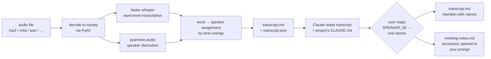

<div align="center">

# claude-listen

**Drop a meeting recording in. Get a speaker-labeled transcript and project-aware notes back.**

A [Claude Code](https://claude.ai/code) skill built on [faster-whisper](https://github.com/SYSTRAN/faster-whisper) and [pyannote.audio](https://github.com/pyannote/pyannote-audio). All local. No extra API calls. Notes written in the vocabulary of whichever project you're in.

[](https://github.com/terminator1333/claude-listen/actions/workflows/ci.yml)
[](./LICENSE)
[](https://www.python.org/)
[](https://claude.ai/code)
[](./CONTRIBUTING.md)

</div>

---

## What you type

```
/listen ~/recordings/standup.m4a extract action items and decisions that affect the roadmap
```

## What you get back, in `./meetings/2026-04-23-1131/`

```
transcript.md        speaker-labeled, timestamped (names, not SPEAKER_00)
transcript.json      word-level timings + diarization segments
meeting-notes.md     structured notes, tailored to your prompt,
                     written in the vocabulary of the current project
metadata.json        duration, language, model, device
```

No cloud transcription. No OpenAI Whisper API. No Otter/Fireflies upload. Audio stays on your machine; the only remote call is a one-time download of model weights from Hugging Face.

---

## 60-second quick-start

```bash
git clone https://github.com/terminator1333/claude-listen.git
cd claude-listen
uv sync
ln -s "$(pwd)" ~/.claude/skills/listen
huggingface-cli login    # paste a classic Read token; see HF setup below
```

Then from any Claude Code session, in any project:

```
/listen path/to/audio.m4a
```

---

## Pipeline



Two Python libraries handle the audio. Claude handles the extraction in-session, using the transcript and the project's `CLAUDE.md` (or `README.md`) for context. No extra LLM call.

## How it compares

| | claude-listen | Otter.ai / Fireflies | Whisper CLI alone | WhisperX |
|---|---|---|---|---|
| **Audio stays local** | yes | no (cloud) | yes | yes |
| **Speaker diarization** | yes (pyannote 3.1) | yes | no | yes (pyannote 2.x) |
| **Notes tailored to your project** | yes (reads CLAUDE.md) | generic summary | no | no |
| **Price per hour** | free | $$ / month | free | free |
| **Claude Code integration** | `/listen` slash command | no | no | no |
| **Custom extraction prompt** | yes (free-text arg) | no | no | no |
| **Works offline after first run** | yes | no | yes | yes |

For a one-off transcription without project context, Whisper or WhisperX is fine. `claude-listen` adds two things on top: a slash-command UX inside Claude Code, and project-aware notes (the transcript alone is 30 KB for a 30-minute meeting — notes distill that into half a page of actually-useful context for future Claude sessions).

## Speaker mapping

Diarization tells you "these voices are different"; it does not tell you who anyone is. After transcription, Claude asks, one speaker at a time:

```
┌─ Who is SPEAKER_00? (120 turns, 2888 words) ─────────────────────┐
│                                                                  │
│   First substantive utterance @ 00:01:                           │
│   "Yeah, so I'm looking at the experiment pipeline tab. In       │
│    the bottom corner there, there's like a list of the           │
│    experiments. Yours is kind of sketched there..."              │
│                                                                  │
│   ▸ Alice (advisor)                                              │
│     Bob                                                          │
│     Charlie                                                      │
│     Other                                                        │
│     Skip / keep anonymous                                        │
└──────────────────────────────────────────────────────────────────┘
```

Name suggestions come from the project's `CLAUDE.md` when one exists. If diarization splits one person across two labels, assign them the same name — the skill merges them. If it merges two people into one, pick whichever attribution is more important; you can fix it by hand afterwards.

## Sample `meeting-notes.md`

```markdown
# Meeting notes — Q2 migration planning

*Recorded 2026-04-15 · 45 min*
*Attendees: Alice, Bob, Charlie*

## Summary

Working session to scope the Q2 migration. The group settled on a
phased rollout plan and identified the schema-validation step as
the critical-path risk.

## Decisions

- Database cutover will be phased, not big-bang (Bob's proposal,
  all agreed). Phase 1 = read-only shadow writes; phase 2 = dual-
  write; phase 3 = cutover after one week of dual-write with zero
  divergence.
- Schema validation runs on every commit, not nightly (Alice).
  Rationale: caught too late otherwise given the 2-week deadline.

## Action items

- Alice — draft the phase-1 shadow-write code by Monday.
- Bob — set up validation CI step this week.
- Charlie — follow up with platform team on connection-pool limits.

## Open questions

- Do we need a rollback path from phase 2 → phase 1, or is the
  shadow-write volume small enough to just replay? Unresolved.
```

More under [`examples/`](./examples/).

## Install

Requires Python 3.10–3.13, [`uv`](https://docs.astral.sh/uv/), and `ffmpeg` in PATH (PyAV ships bundled libav, so `ffmpeg` the binary is optional for most formats).

```bash
# 1. Clone the repo.
git clone https://github.com/terminator1333/claude-listen.git
cd claude-listen

# 2. Install deps. Torch comes from the CUDA 12.1 index by default; works on CPU too.
uv sync

# 3. Link it as a Claude Code skill.
ln -s "$(pwd)" ~/.claude/skills/listen

# 4. Set up HF access for pyannote (one time).
```

### Hugging Face setup

The pyannote diarization model is gated, so you need a one-time setup:

1. Create a **classic Read token** at [hf.co/settings/tokens](https://hf.co/settings/tokens). (Fine-grained tokens work but need the "Read access to contents of all public gated repos you can access" permission.)
2. Accept the ToS on **both** model pages while logged in as the token owner:
   - [hf.co/pyannote/speaker-diarization-3.1](https://hf.co/pyannote/speaker-diarization-3.1)
   - [hf.co/pyannote/segmentation-3.0](https://hf.co/pyannote/segmentation-3.0)
3. Cache the token:
   ```bash
   huggingface-cli login
   ```
   Or set `HF_TOKEN=...` in your shell rc. Either works; the script checks env vars first, then `~/.cache/huggingface/token`.

### CUDA version

The default `uv sync` pulls torch from PyTorch's CUDA 12.1 index (pinned in `pyproject.toml` so it matches `ctranslate2`, faster-whisper's backend). This works on most modern GPUs — RTX 30/40-series, A100, A6000, H100 — and falls back to CPU on machines without CUDA.

For a different CUDA version, edit the index block in `pyproject.toml`:

```toml
[[tool.uv.index]]
name = "pytorch-cu118"    # or cu124, cu126, etc.
url = "https://download.pytorch.org/whl/cu118"
explicit = true
```

…then re-run `uv sync`.

## Use

### Inside Claude Code

```
/listen path/to/audio.m4a
/listen path/to/audio.m4a only the action items, no summary
/listen path/to/audio.m4a what did we decide about the API redesign?
```

The free-text part guides what Claude emphasizes in the notes. Leave it blank for the full default structure (summary, decisions, action items, open questions, technical discussion, flagged follow-ups).

Output goes to `<current-project>/meetings/<YYYY-MM-DD-HHMM>/`.

### Directly as a CLI (no Claude)

```bash
uv run python scripts/transcribe.py --audio meeting.m4a --output-dir out/

# Options
#   --model {tiny,base,small,medium,large-v2,large-v3}  default: small
#   --device {auto,cuda,cpu}                            default: auto
#   --language en                                       default: auto-detect
#   --num-speakers 3                                    default: infer
#   --no-diarize                                        skip speaker separation
```

Useful if you want to batch-process recordings without going through Claude.

## Hardware notes

Rough wall-clock times for a 60-minute mono recording:

| Hardware            | Model     | Transcribe | Diarize | Total  |
|---------------------|-----------|------------|---------|--------|
| CPU (8 cores)       | `small`   | ~8 min     | ~6 min  | ~14 min |
| CPU (8 cores)       | `medium`  | ~22 min    | ~6 min  | ~28 min |
| GPU (consumer)      | `small`   | ~30 s      | ~45 s   | ~75 s  |
| GPU (consumer)      | `large-v3`| ~1.5 min   | ~45 s   | ~2.5 min |

Numbers vary with recording quality, number of speakers, and model cache state. Diarization dominates on GPU because pyannote's pipeline is less GPU-bound than Whisper.

## Limitations

- Transcript quality depends on audio quality. Noisy rooms, strong accents, and overlapping speech degrade results. Diarization especially struggles with heavy overlap.
- Transcription only, not translation. A meeting in French comes out as French text; Claude can write English notes on request.
- No voice enrollment. Speakers come out as anonymous labels and you identify them per meeting. (Contribution welcome — see [CONTRIBUTING.md](./CONTRIBUTING.md).)
- Outputs go to the current directory's `meetings/` folder. Move or symlink the folder afterwards if you want them elsewhere.

## Contributing

See [CONTRIBUTING.md](./CONTRIBUTING.md) for how to set up a dev environment, run the test pass, and submit PRs. The codebase is small (one script + one skill file), so first-time contributors are very welcome.

Some good places to start:

- Voice enrollment / auto-labeling across meetings (needs a speaker-embedding store).
- Translation mode (`--translate en` in Whisper).
- Streaming / live mode.
- Better error messages when diarization disagrees with the transcript.

## Disclaimer

This software is provided **as is**, without warranty of any kind, express or implied. See [LICENSE](./LICENSE) for the full legal terms.

In particular, `claude-listen` is a personal-use tool built on research-grade open-source components. You are responsible for:

- **Recording consent.** Laws vary by jurisdiction — one-party consent in some places, all-party consent in others. Get consent from everyone on the call before recording. This tool does not verify or enforce consent.
- **Privacy and data handling.** Audio recordings and the transcripts derived from them may contain confidential or personal material. Decide whether your storage, access controls, backups, and cloud-sync settings are appropriate for the content you're processing. The skill writes outputs to disk under the current working directory — be deliberate about where that is.
- **Accuracy.** Transcription and diarization are imperfect. faster-whisper can mis-hear words; pyannote can mis-attribute speakers or split one person across labels. Errors are more common with poor audio, strong accents, overlapping speech, or background noise. Do not rely on `meeting-notes.md` as a substitute for anything where a misquote or mis-attribution could cause harm (legal testimony, medical decisions, contractual commitments). Always verify against the source recording when stakes are high.
- **Model behavior.** Claude writes the notes by reading the transcript and the project's `CLAUDE.md`. It may summarize inaccurately, miss nuance, or infer things that weren't said. Review the output before acting on it or sharing it.
- **Third-party services.** Pyannote's models are downloaded from Hugging Face; you accept their terms when you fetch them. Hugging Face and any cloud services you connect the tool to are outside our control.

The authors and contributors accept no liability for any loss, damage, legal exposure, or other harm arising from use of this software — including but not limited to privacy breaches, disputes over recordings, data corruption, or decisions made on the basis of inaccurate transcripts or notes.

Use at your own risk.

## License

[MIT](./LICENSE).

## Acknowledgements

Built on the work of:

- [faster-whisper](https://github.com/SYSTRAN/faster-whisper) by SYSTRAN — the CTranslate2 backend for OpenAI Whisper.
- [pyannote.audio](https://github.com/pyannote/pyannote-audio) by Hervé Bredin et al. — the speaker diarization toolkit.
- [Whisper](https://github.com/openai/whisper) by OpenAI.
- [Claude Code](https://claude.ai/code) by Anthropic.
