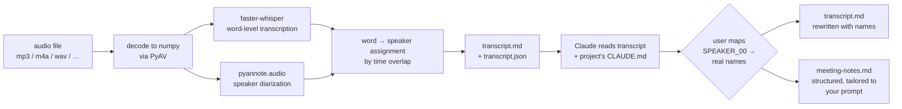

# listen — audio meetings to Claude-ready notes

A Claude Code skill that turns an audio recording into two things:

1. A speaker-labeled transcript with timestamps.
2. A structured `meeting-notes.md` written in the vocabulary of the current project (if a `CLAUDE.md` is present).

You invoke it inside Claude Code like a slash command:

```
/listen ~/recordings/standup.m4a extract action items and decisions that affect the roadmap
```

The free-text instruction after the path is optional. With no instruction, you get the full default structure (summary, decisions, action items, open questions, technical discussion, follow-ups).

## Pipeline



Two Python libraries do the heavy lifting; Claude does the extraction in-session. No extra LLM API calls.

- **Transcription**: [faster-whisper](https://github.com/SYSTRAN/faster-whisper) (CTranslate2 backend for Whisper).
- **Speaker diarization**: [pyannote.audio](https://github.com/pyannote/pyannote-audio) 3.x.
- **Extraction**: Claude reads the transcript and the project's `CLAUDE.md`, then writes the notes.

GPU is used if available, otherwise CPU.

## How speaker identification works

Diarization is anonymous — the model only knows "this is a different voice from the last one", not who anyone is. You get labels `SPEAKER_00`, `SPEAKER_01`, and so on. Once transcription finishes, the skill walks through each detected speaker and asks you who they are.

For each speaker you see:

- The label (`SPEAKER_00`)
- Their first substantive utterance as context (short filler like "yeah" or "uh-huh" is skipped so you get something actually identifying)
- A list of likely names pulled from the project's `CLAUDE.md` when one exists, plus a "skip / keep anonymous" option

You pick a name (or type your own via the "Other" fallback). The skill then rewrites `transcript.md` and `transcript.json` in place, substituting the real names throughout, before writing `meeting-notes.md`.

If diarization splits one person across two labels or merges two people into one, you'll see the mismatch and can either assign the same name to both split labels or pick the more likely person for a merged one — the notes will reflect whatever mapping you give.

## Install

Requires Python 3.10+, `uv`, and `ffmpeg` in PATH.

```bash
# 1. Clone the repo.
git clone https://github.com/terminator1333/claude-listen.git
cd claude-listen

# 2. Install deps.
uv sync

# 3. Link it as a Claude Code skill.
ln -s "$(pwd)" ~/.claude/skills/listen

# 4. Set up HF access for pyannote (one time).
#    a. Create a *classic* Read token at https://hf.co/settings/tokens
#       (fine-grained tokens need extra "public gated repos" permission — easier to just use Read).
#    b. Accept the ToS on BOTH these model pages while logged in as the token owner:
#         https://hf.co/pyannote/speaker-diarization-3.1
#         https://hf.co/pyannote/segmentation-3.0
#    c. Cache the token for pyannote and the rest of the HF ecosystem:
huggingface-cli login
#    (or export HF_TOKEN=<your-token> — either works)
```

### CUDA version

`uv sync` pulls torch from PyTorch's CUDA 12.1 index by default (pinned in `pyproject.toml` to match `ctranslate2`'s CUDA runtime). This works on most modern consumer and datacenter GPUs (RTX 30-series, 40-series, A100, A6000, H100, etc.) and also falls back cleanly to CPU on machines without CUDA.

If your GPU needs a different CUDA version, edit the `[[tool.uv.index]]` block in `pyproject.toml`:

```toml
[[tool.uv.index]]
name = "pytorch-cu118"    # or cu124, cu126, etc.
url = "https://download.pytorch.org/whl/cu118"
explicit = true
```

…then re-run `uv sync`.

## Use

From any Claude Code session:

```
/listen path/to/audio.m4a
```

Or with an extraction focus:

```
/listen path/to/audio.m4a just the action items please, nothing else
```

Output goes to `./meetings/<YYYY-MM-DD-HHMM>/`:

- `transcript.md` — speaker-labeled, timestamped.
- `transcript.json` — full structured data (word-level timings, diarization segments).
- `meeting-notes.md` — structured extraction tailored to your instruction.
- `metadata.json` — model, device, duration, detected language.

### Speaker mapping dialog

After transcription, you'll see something like this in Claude Code, one question per detected speaker:

```
┌─ Who is SPEAKER_00? (120 turns, 2888 words) ─────────────────────┐
│                                                                  │
│   First substantive utterance @ 00:01:                           │
│   "Yeah, so I'm looking at the experiment pipeline tab. In       │
│    the bottom corner there, there's like a list of the           │
│    experiments. Yours is kind of sketched there..."              │
│                                                                  │
│   ▸ Alice (advisor)                                              │
│     Bob                                                          │
│     Charlie                                                      │
│     Other                                                        │
│     Skip / keep anonymous                                        │
└──────────────────────────────────────────────────────────────────┘
```

Name suggestions come from the project's `CLAUDE.md` when one's present. If diarization splits one person across two labels (`SPEAKER_03` and `SPEAKER_05` are both Bob), assign them the same name — the skill merges them in the final output.

### Sample `meeting-notes.md`

```markdown
# Meeting notes — Weekly planning

*Recorded 2026-04-15 · 45 min*
*Attendees: Alice, Bob, Charlie*

## Summary

Working session to scope the Q2 migration. The group settled on a
phased rollout plan and identified the schema-validation step as
the critical-path risk.

## Decisions

- Database cutover will be phased, not big-bang (Bob's proposal,
  all agreed). Phase 1 = read-only shadow writes; phase 2 = dual-
  write; phase 3 = cutover after one week of dual-write with zero
  divergence.
- Schema validation runs on every commit, not nightly (Alice).
  Rationale: caught too late otherwise given the 2-week deadline.

## Action items

- Alice — draft the phase-1 shadow-write code by Monday.
- Bob — set up validation CI step this week.
- Charlie — follow up with platform team on connection-pool limits.

## Open questions

- Do we need a rollback path from phase 2 → phase 1, or is the
  shadow-write volume small enough to just replay? Unresolved.
```

## Running the CLI directly (without Claude)

```bash
uv run python scripts/transcribe.py --audio meeting.m4a --output-dir out/
# Options:
#   --model {tiny,base,small,medium,large-v2,large-v3}  default: small
#   --device {auto,cuda,cpu}                            default: auto
#   --language en                                       default: auto-detect
#   --num-speakers 3                                    default: infer
#   --no-diarize                                        skip speaker separation
```

## Hardware notes

Rough wall-clock times for a 60-minute mono recording:

| Hardware            | Model     | Transcribe | Diarize | Total |
|---------------------|-----------|------------|---------|-------|
| CPU (8 cores)       | `small`   | ~8 min     | ~6 min  | ~14 min |
| CPU (8 cores)       | `medium`  | ~22 min    | ~6 min  | ~28 min |
| GPU (consumer)      | `small`   | ~30 s      | ~45 s   | ~75 s |
| GPU (consumer)      | `large-v3`| ~1.5 min   | ~45 s   | ~2.5 min |

Numbers vary with recording quality, number of speakers, and model cache state.

## Limitations

- Transcript quality depends on audio quality. Noisy rooms, strong accents, and overlapping speech all degrade results. Diarization especially struggles with heavy overlap.
- Only transcribes, doesn't translate. A meeting in French comes out as French text. Claude can still write English notes on request.
- No voice enrollment — speakers come out as anonymous labels; you identify them manually per meeting.
- Outputs are written to the current directory's `meetings/` folder. If you want them elsewhere, move the directory afterwards.

## License

MIT.
